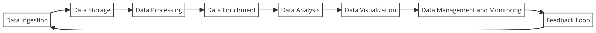

Dag 2 - arbetsflöde

---

Github: https://github.com/obeq/big-data-playground

---

### 1. Data Ingestion

- Real-time ingestion
- Batch ingestion

Note:

- **Real-time ingestion** involves streaming data directly into the pipeline as it's generated, using tools like Apache Kafka, Amazon Kinesis, or Google Pub/Sub.
- **Batch ingestion** involves collecting data at specific intervals and is handled by tools like Apache Sqoop or traditional ETL platforms.

Data ingestion is the initial stage where data is collected or imported into the system from various sources. These sources can be databases, web services, IoT devices, online transactions, etc. The goal here is to gather raw data in real-time or batch mode.

---

### 2. Data Storage

- Data Lakes
- Data Warehouses

Note:
Once data is ingested, it needs to be stored in a system that can handle the scale and nature of the data.

- **Data Lakes**: Store raw, unstructured data in its native format. Tools like Apache Hadoop HDFS or cloud solutions like Amazon S3 are common.
- **Data Warehouses**: Structured, filtered data is stored here for more straightforward access and analysis. Examples include Google BigQuery, Amazon Redshift, and Snowflake.

---

### 3. Data Processing

- Batch Processing
- Stream Processing

Note:
This is the stage where raw data is transformed into a format suitable for analysis. This involves cleaning, normalizing, transforming, and enriching the data.

- **Batch Processing**: Processes large volumes of data all at once. Tools like Apache Hadoop MapReduce are typical.
- **Stream Processing**: Processes data in real-time as it arrives. Apache Spark Streaming and Apache Flink are popular tools for this.

---

### 4. Data Enrichment

Note:
Data enrichment involves enhancing the raw or intermediate data by merging it with other data sources to add context or additional insights. This step can also include data validation to ensure accuracy and completeness.

---

### 5. Data Analysis

- Desciptive Analytics
- Predictive Analytics
- Prescriptive Analytics

Note:
At this stage, the processed data is analyzed to extract actionable insights. This can involve:

- **Descriptive Analytics**: Understanding what happened based on historical data.
- **Predictive Analytics**: Using statistical models and machine learning to predict future outcomes.
- **Prescriptive Analytics**: Suggesting actions based on the results of predictive analytics.

Tools commonly used here include Python libraries like Pandas and Scikit-Learn, R, and specialized analytics platforms.

---

### 6. Data Visualization

Note:
The insights derived from the analysis phase are often visualized to make them easier to understand and actionable. Visualization tools like Tableau, Power BI, or even Python libraries like Matplotlib and Seaborn are used to create dashboards, reports, and real-time visual feeds.

---

### 7. Data Management and Monitoring

- Data Governance
- Performance Monitoring

Note:
Managing the flow of data through this pipeline and monitoring its performance is crucial to ensure efficiency and accuracy. This involves:

- **Data Governance**: Ensuring that the data complies with standards and policies, especially concerning security and privacy.
- **Performance Monitoring**: Tools like Apache Ambari, Grafana, or cloud-specific tools like AWS CloudWatch to monitor health and performance of the pipeline.

---

### 8. Feedback Loop

Note:
An often overlooked but critical component, the feedback loop involves using the outputs of the data analysis to refine and improve the input data collection, processing techniques, and the overall pipeline strategy.
